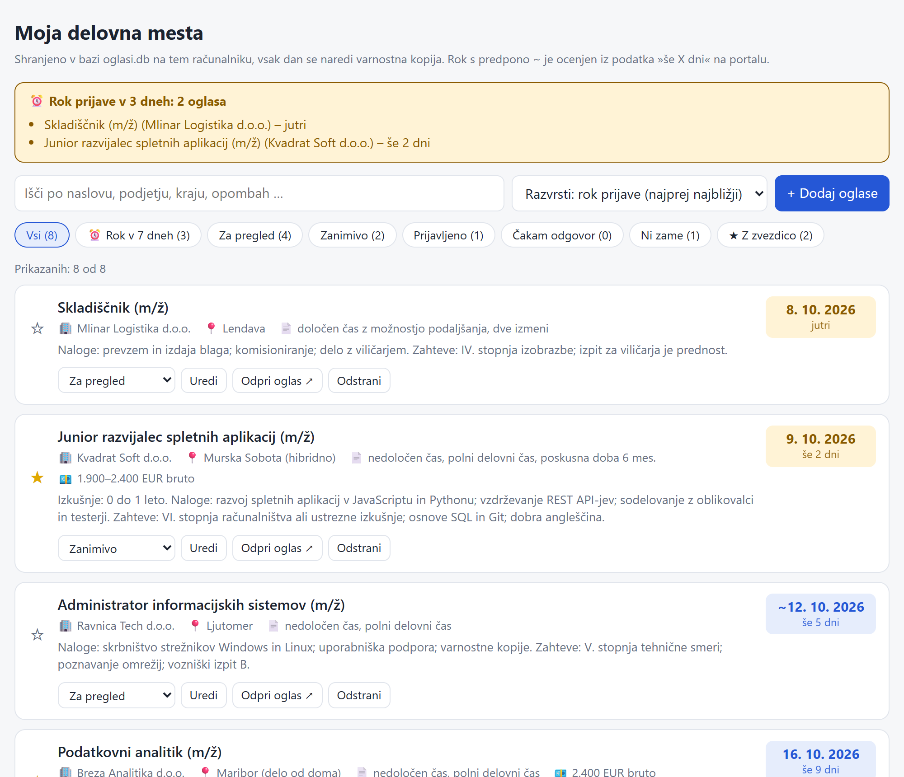
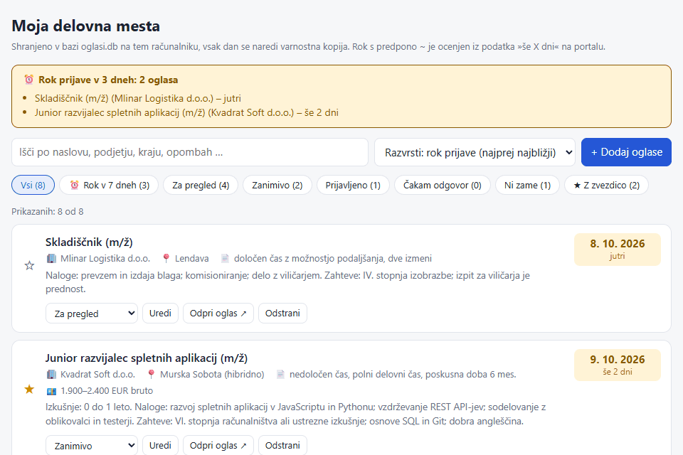
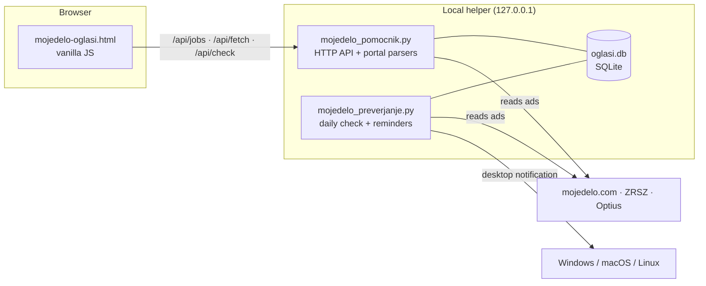

# Job Ad Tracker (mojedelo · ZRSZ · Optius)

[](https://github.com/Horvatium/job-ad-tracker/actions/workflows/tests.yml)
[](LICENSE)

> **SL:** Lokalna aplikacija za spremljanje prostih delovnih mest s slovenskih portalov. Prilepiš povezavo do oglasa, aplikacija sama prebere naslov, podjetje, kraj, vrsto zaposlitve in rok prijave ter oglase razvrsti po roku. Vsak dan preveri, ali so oglasi še objavljeni, in te z obvestilom opomni na roke. Podatki ostanejo na tvojem računalniku.

A small local-first web app for keeping track of job ads from Slovenian job portals. Paste a link, and a local Python helper reads the ad (title, employer, location, employment type, salary, application deadline, duties and requirements). The list is sorted by deadline, the helper checks once a day whether your ads are still published, and a desktop notification reminds you before a deadline passes.

It replaces the "dozens of open browser tabs" workflow with one page.

<picture>
  <source media="(prefers-color-scheme: dark)" srcset="docs/screenshot-dark.png">
  
</picture>

**Adding an ad:** paste a link, and the helper fills in the details. Then filter by deadline or status:



<sub>Example ads use fictional companies; the added ad is a real public listing.</sub>

## Features

- **Paste links, get data**: one or more URLs at a time from [mojedelo.com](https://www.mojedelo.com), [ZRSZ](https://www.ess.gov.si) (Employment Service of Slovenia) and [Optius](https://www.optius.com), or **any company career page**: a generic reader uses structured data (`JobPosting`) when the page has it, and the page text otherwise.
- **Deadlines first**: deadline badge with days left, warning banner for ads closing within 3 days, "closing in 7 days" filter, default sort by deadline.
- **Works for you in the background**: once a day the helper checks whether ads you haven't applied to yet are still published, replaces estimated deadlines with exact ones, and shows a desktop notification (Windows, macOS, Linux) three days and one day before a deadline, and when an ad is taken down. Each reminder is shown only once.
- **Your data in one file**: everything is stored in a SQLite database (`oglasi.db`) with a daily backup (last 14 days kept). On first run, ads already saved in the browser are moved into the database automatically.
- Status workflow (to review → interesting → applied → waiting → not for me) with the date of each change, favourites, notes, search and filters, manual editing of every field.
- **Calendar export**: deadlines of open ads as an `.ics` file (Google Calendar, Outlook, Apple Calendar) with reminders at 9:00 three days and one day before. Events have stable UIDs, so re-importing updates them instead of creating duplicates (in apps that support it).
- Re-reading never overwrites your own notes or manually entered deadlines; estimated deadlines (`~`) are replaced by exact ones when they become available.
- JSON export/import (replace or merge) and CSV export for Excel (Slovenian locale: `;` separator, UTF-8 BOM).
- First run shows a few example ads (fictional companies, deadlines relative to today) that can be removed with one click.
- Works without the helper too (open the HTML file directly): the list is then kept in the browser, without automatic reading or checks.

## Quick start

Requires Python 3.8+ and nothing else (standard library only).

```bash
python mojedelo_pomocnik.py
```

This opens `http://localhost:8765`. Keep the window open while you use the app.

| Option | |
|---|---|
| `--port 9000` | first port to try (then up to +9) |
| `--no-browser` | don't open the browser on start |
| `--data-dir PATH` | where to keep `oglasi.db` and `backups/` (default: next to the script) |
| `--no-check` | no daily check and no notifications |
| `--test-notification` | show a test notification and exit |

**Reminders even when the page is closed (Windows):** the helper has to be running. To start it with Windows, press `Win+R`, open `shell:startup` and create a shortcut there with the target:

```
pythonw.exe "C:\path\to\mojedelo_pomocnik.py" --no-browser
```

`pythonw` runs without a console window. Clicking a notification opens the app.

## Architecture



| Module | Responsibility |
|---|---|
| `mojedelo-oglasi.html` | The whole UI in one file (vanilla JS, no build step). Talks to the helper's API, or falls back to `localStorage` when opened directly. |
| `mojedelo_pomocnik.py` | Local HTTP server and portal parsers. |
| `mojedelo_baza.py` | SQLite storage: schema with versioned migrations, validation, status history, daily backups. |
| `mojedelo_preverjanje.py` | Background work: daily check, reminders, notifications. Fetching and notifying are injected, so it is tested without network or desktop. |

### API

| Endpoint | |
|---|---|
| `GET /api/ping` | helper status (`storage`, `check`) |
| `GET /api/jobs` | all saved ads |
| `POST /api/jobs/batch` | `{upsert: [...], delete: [ids]}` in one transaction |
| `GET /api/fetch?url=…` | read one ad from a supported portal |
| `POST /api/check`, `GET /api/check` | start the check now / progress |

### Portals

Every portal adapter returns the same shape:
`ok, title, company, location, type, salary, deadline (YYYY-MM-DD), dlApprox, notes, warnings`.

| Portal | Source | Notes |
|---|---|---|
| mojedelo.com | JSON API | The site is a SPA (the HTML is a 4 KB shell), so the helper calls the same API the site uses. If the API fails, it falls back to parsing the page HTML/text. |
| ZRSZ | JSON API | Data comes in UPPERCASE; titles and company names are normalised (`NATAKAR - M/Ž` → `Natakar (m/ž)`, trailing seat of the company removed). |
| Optius | HTML + JSON-LD `JobPosting` | JSON-LD contains raw newlines inside strings, so it is parsed with `json.loads(strict=False)`; duties and requirements come from the page sections. |
| Any other page (company careers) | JSON-LD `JobPosting`, else page text | Most career sites publish `JobPosting` for Google for Jobs. Without it, the reader takes the title and company from `<title>` (`Komisionar » Mercator d.o.o.`), labelled values (`Kraj opravljanja dela: …`), and the deadline only from lines about applying (`Prijave pričakujemo do 13.10.2026`), so "fixed-term until 31. 12. 2027" is not mistaken for a deadline. Slovenian month names are understood. A 404 or a redirect to the parent listing means the ad was taken down. |

### Design decisions

- **API instead of scraping a SPA.** The mojedelo page renders client-side; the API is faster, more stable and returns structured data (exact deadline, employment type, probation period).
- **Deadlines in local time.** mojedelo returns `endDate` in UTC; a deadline of `2026-10-11T21:59:59Z` is 11 October in Slovenia, not 12 October. Conversion uses the EU DST rule (last Sunday of March/October) with no dependency on `zoneinfo`/`tzdata`, which is missing on many Windows installs.
- **A local server is still an attack surface.** Any website you visit can send requests to `localhost`. The helper binds to `127.0.0.1` and rejects requests whose `Host` header is not `localhost` (DNS rebinding). Writes are accepted only as `application/json` from a local `Origin`, and reading an ad requires a custom `X-Pomocnik` header; a foreign page cannot send either without a CORS preflight that the helper never approves (CSRF).
- **Reading any page without becoming a proxy into your network.** Since company pages can be on any domain, the helper resolves every URL and refuses addresses that are not public (loopback, private ranges, link-local such as `169.254.169.254`), and checks every redirect the same way (SSRF).
- **Page and background check never overwrite each other.** The page only sends ads that changed since the last save. Fields set by the helper (`statusAt`, `checkedAt`, `checkState`) cannot be written by the page, and the check only replaces a missing or estimated deadline, never one entered by hand.
- **Nothing is lost when the helper is down.** Unsaved changes are kept in the browser and sent on the next start.
- **User data wins.** Automatically generated notes are tracked separately (`autoNotes`); once you edit a note, re-reading the ad will not touch it.
- **Notifications without tripping antivirus.** The first version showed Windows notifications through a hidden PowerShell process, which antivirus software (Avast) blocked as a suspicious command line. Windows notifications now call the Win32 API directly (`Shell_NotifyIconW` via `ctypes`), with no child process. macOS uses `osascript`, Linux `notify-send`.
- **No dependencies.** Standard library only (`http.server`, `sqlite3`, `urllib`, `ctypes`).

## Tests

```bash
pip install -r requirements-dev.txt
pytest
```

- Parsers are tested against real responses from each portal saved in `tests/fixtures/`, so the tests run offline. Network access is blocked in tests that do not expect it.
- Storage: validation, status history, fields the page cannot overwrite, transactions, backups and rotation.
- Background check and reminders: classification of results, reminders shown once, no parallel runs.
- The local server end-to-end on a random port: allowed hosts, `Host`/`Origin`/content-type checks, the jobs API.

Tests run on GitHub Actions on every push.

## Limitations

- Company pages are read from their text, so check the result; pages that load the ad with JavaScript only give a title, and the rest is filled in with "Edit".
- Parsers depend on third-party APIs and page structure, which can change without notice. The helper re-reads public API configuration on authentication errors, but there is no guarantee.
- Reminders need the helper to be running (see the autostart tip above). The `.ics` export works without it.
- Data is on one computer; there is no sync between devices.
- Where only "N days left" is available, the deadline is an estimate and may be off by a day (shown as `~`).

## Roadmap

- One parser module per portal behind a common interface
- Saved searches: get notified only about new ads matching e.g. "IT, Pomurje"
- Application log: contact person, next step, conversation notes

## License

[MIT](LICENSE) © Vid (Horvatium)

## Disclaimer

This is a personal tool. It reads publicly available job ads one at a time: when the user adds or refreshes an ad, and once a day for ads on the user's own list that are not yet applied to (with a pause of a few seconds between requests). It does not crawl, bulk-download or republish portal content. It uses the same public endpoints the portals' own websites use, which are undocumented and not an official API. Check each portal's terms of use before using it, and do not use it for bulk data collection. Not affiliated with mojedelo.com, ZRSZ, Optius or any employer whose pages it reads.
