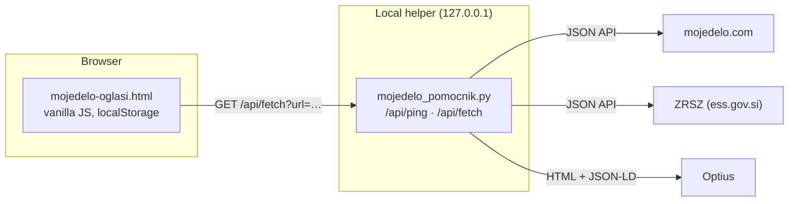

# Job Ad Tracker (mojedelo · ZRSZ · Optius)

> **SL:** Lokalna aplikacija za spremljanje prostih delovnih mest s slovenskih portalov. Prilepiš povezavo do oglasa, aplikacija sama prebere naslov, podjetje, kraj, vrsto zaposlitve in rok prijave ter oglase razvrsti po roku. Podatki ostanejo na tvojem računalniku.

A small local-first web app for keeping track of job ads from Slovenian job portals. Paste a link, and a tiny local Python helper reads the ad (title, employer, location, employment type, salary, application deadline, duties and requirements). The list is sorted by deadline, so no application window is missed.

It replaces the "dozens of open browser tabs" workflow with one page.

<!-- TODO: screenshot / short GIF (add ad → deadline → filter) -->

## Features

- **Paste links, get data**: one or more URLs at a time from [mojedelo.com](https://www.mojedelo.com), [ZRSZ](https://www.ess.gov.si) (Employment Service of Slovenia) and [Optius](https://www.optius.com).
- **Deadlines first**: deadline badge with days left, warning banner for ads closing within 3 days, "closing in 7 days" filter, default sort by deadline.
- Status workflow (to review → interesting → applied → waiting → not for me), favourites, notes, search and filters, manual editing of every field.
- Re-reading never overwrites your own notes or manually entered deadlines; estimated deadlines (`~`) are replaced by exact ones when they become available.
- JSON export/import (replace or merge) and CSV export for Excel (Slovenian locale: `;` separator, UTF-8 BOM).
- Works without the helper too (open the HTML file directly), just without automatic reading.

## Quick start

Requires Python 3.8+ and nothing else (standard library only).

```bash
python mojedelo_pomocnik.py
```

This opens `http://localhost:8765`. Options: `--port 9000`, `--no-browser`.

## Architecture



Every portal adapter returns the same shape:
`ok, title, company, location, type, salary, deadline (YYYY-MM-DD), dlApprox, notes, warnings`.

| Portal | Source | Notes |
|---|---|---|
| mojedelo.com | JSON API | The site is a SPA (the HTML is a 4 KB shell), so the helper calls the same API the site uses. If the API fails, it falls back to parsing the page HTML/text. |
| ZRSZ | JSON API | Data comes in UPPERCASE; titles and company names are normalised (`NATAKAR - M/Ž` → `Natakar (m/ž)`, trailing seat of the company removed). |
| Optius | HTML + JSON-LD `JobPosting` | JSON-LD contains raw newlines inside strings, so it is parsed with `json.loads(strict=False)`; duties and requirements come from the page sections. |

### Design decisions

- **API instead of scraping a SPA.** The mojedelo page renders client-side; the API is faster, more stable and returns structured data (exact deadline, employment type, probation period).
- **Deadlines in local time.** mojedelo returns `endDate` in UTC; a deadline of `2026-10-11T21:59:59Z` is 11 October in Slovenia, not 12 October. Conversion uses the EU DST rule (last Sunday of March/October) with no dependency on `zoneinfo`/`tzdata`, which is missing on many Windows installs.
- **The helper is not an open proxy.** `/api/fetch` only accepts the three portal domains, the server binds to `127.0.0.1`, and it rejects requests whose `Host` header is not `localhost`/`127.0.0.1` (protection against DNS rebinding from a malicious website).
- **User data wins.** Automatically generated notes are tracked separately (`autoNotes`); once you edit a note, re-reading the ad will not touch it.
- **No build step, no dependencies.** One HTML file and one Python file; easy to run on any machine.

## Tests

```bash
pip install -r requirements-dev.txt
pytest
```

Parsers are tested against real responses from each portal saved in `tests/fixtures/`, so the tests run offline. Network access is blocked in tests that do not expect it. The local server is tested end-to-end on a random port (allowed hosts, `Host` header check, routing). Tests run on GitHub Actions on every push.

## Limitations

- Parsers depend on third-party APIs and page structure, which can change without notice. The helper re-reads public API configuration on authentication errors, but there is no guarantee.
- Data lives in the browser's `localStorage`. `file://` and `http://localhost` are different origins and don't share data, so use JSON export/import to move between them. Back up with JSON export.
- Where only "N days left" is available, the deadline is an estimate and may be off by a day (shown as `~`).

## Roadmap

- SQLite storage in the helper (with automatic migration from `localStorage`) and backups
- Deadline reminders and `.ics` calendar export
- One parser module per portal behind a common interface; a generic JSON-LD `JobPosting` parser for company career pages
- Daily check whether saved ads are still published

## License

[MIT](LICENSE) © Vid (Horvatium)

## Disclaimer

This is a personal tool. It reads publicly available job ads one at a time, only when the user adds or refreshes an ad, and does not crawl, bulk-download or republish portal content. It uses the same public endpoints the portals' own websites use, which are undocumented and not an official API. Check each portal's terms of use before using it, and do not use it for bulk data collection. Not affiliated with mojedelo.com, ZRSZ or Optius.
